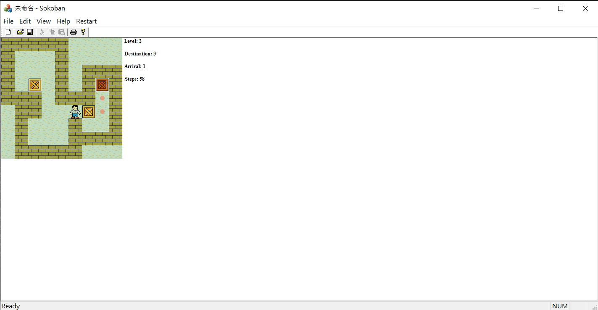

# Sokoban on MFC
- 程式設計 (2022) 期末專題

## Icons
1.  Wall
2.  Worker
3.  Box
4.  Destination
5.  Arrival (a box arriving at a destination position)
6.  Blank

## Play
- Use WASD, HJKL or arrow keys to control the worker.
- Go to **File** > **Save** to save game progress. 
- 
